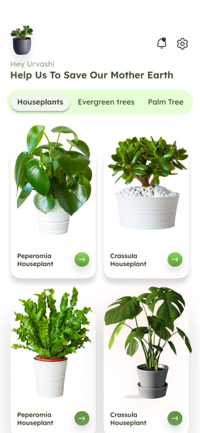
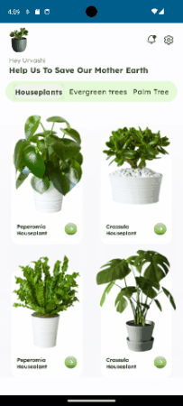

# App-Design-First-Project
A project done as a first project for our 4th year *'Application Design'* course as a part of our UX Design track.
\
We were given the choice between five different designs, and the goal of the project is to replicate them either in **iOS** or **Android**.

## Chosen Design
I chose to work on the fifth design, as it looked not too complicated to replicate, but not too simple as well. I could already notice the grid of elements displaying the plants, and I knew that it would be somewhat of a "challenge" to work on.

## Chosen Technology and why
I chose to work on **Android** with **Compose** because:
- Objectively:
  - More efficient even though it is more recent & incomplete
- Subjectively:
  - Easier to understand and to read
  - More documentation available

The reason why I chose **Android** is because I do not have a Mac to work on, so I could not code for iOS. And, having already worked with React.js before, I wanted to learn something new.

## Bonus Features
- Showing other types of plants when changing the selection in the navbar

- Giving each plant its own page with more detailed info

## Challenges Encountered
- Importing custom fonts
  - As I worked on ***Android Studio***, it turned out that the software just needs to refresh its caches sometimes
  - I had correctly imported the fonts, thanks to some YouTube videos, but the software hadn't taken these modifications into account before I had ***cleaned & rebuilt*** the project.
- Overflow of the pictures within Box elements
  - In the reference design, we can see that the leaves of the plants are expanding outside of the box, so I knew that I had to use the ***Box*** layout container
  - Unfortunately, the ***LazyVerticalGrid*** I used was inside another component, so the because were getting cut off by its bounds.
  - Using an ***offset*** modifier on the different pictures turned out to resolve this issue.
- Navigating to other pages with *NavHost*
  - Turned out to be a careless mistake, I had done everything correctly, but the app kept navigating to the other screen because I hadn't made the corresponding buttons ***clickable***.
